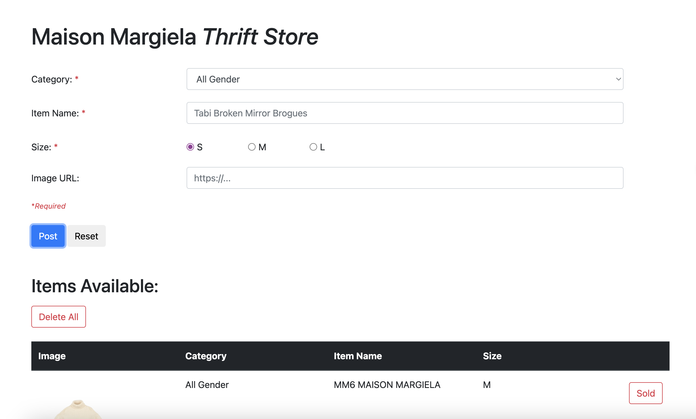
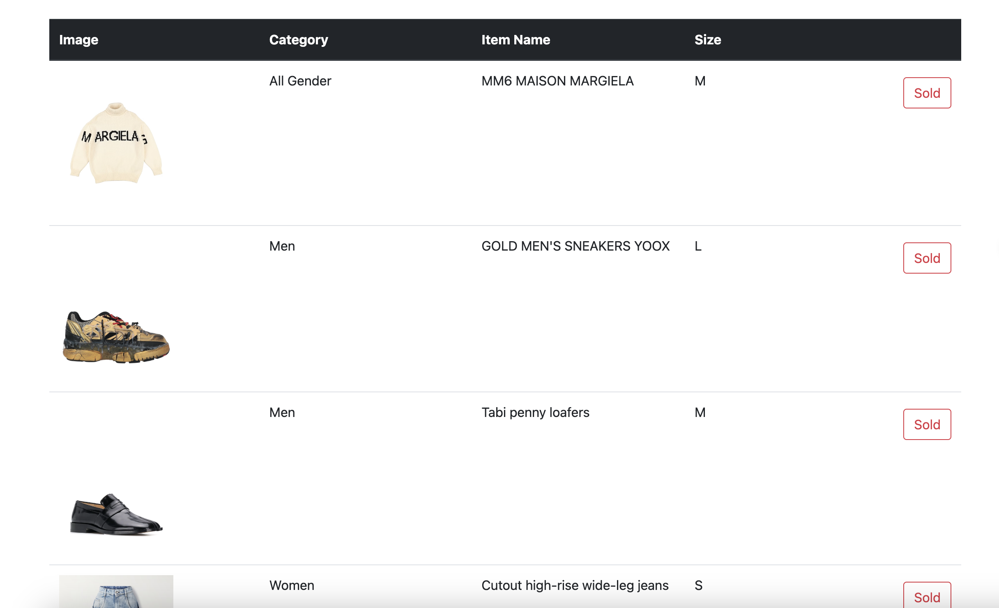
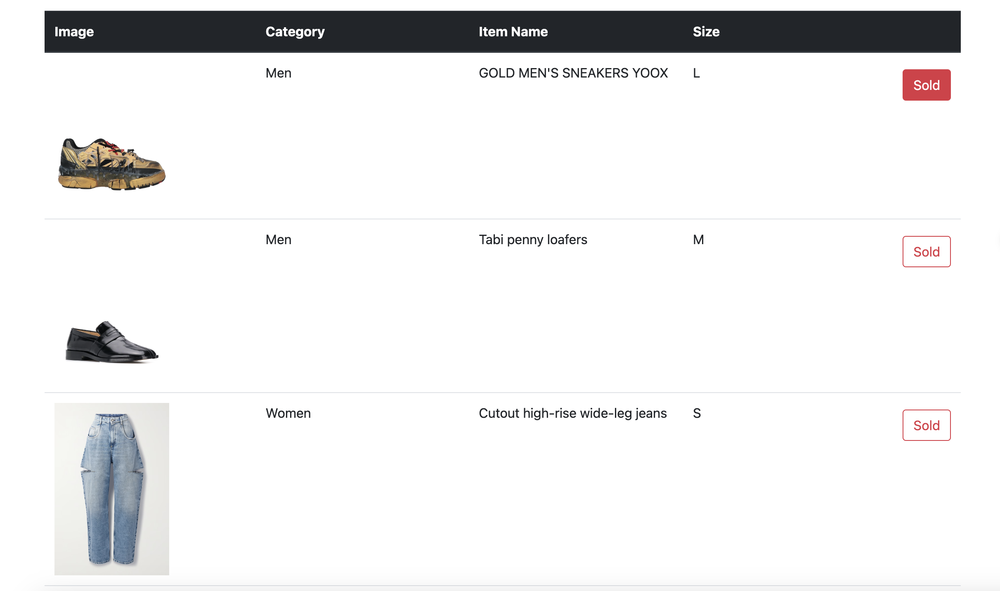
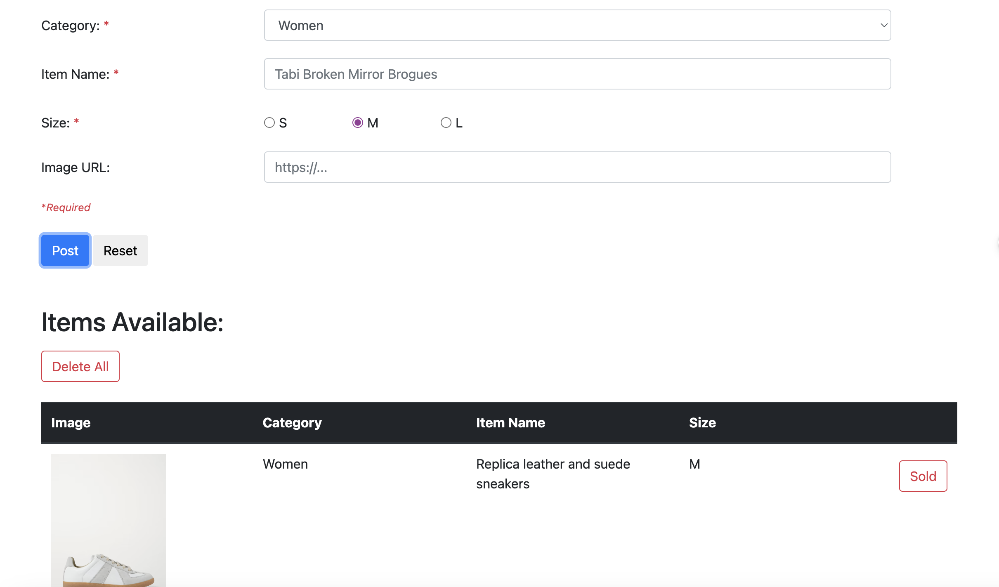
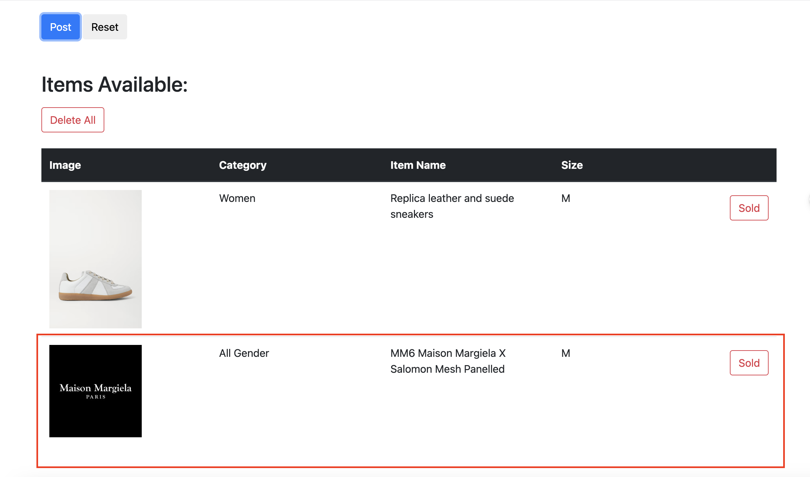

# Maison-Margiela-Thrift-Store-web-app
The Maison Margiela Thrift Store web app allows web administrator to post secondhand Maison Margiela items for sale and view a gallery of available items. Administrator can add, arrange, and delete product items from an inventory list.

## Features
- Add new products to the table with details like image, category, name, and size
- Validation checks for required fields when submitting a new product
- Duplicate item name detection when adding new products
- Delete individual products by clicking the "Sold" button
- Delete all products in the table with the "Delete All" button
- Mobile responsive design

## Technologies
- HTML
- CSS
- Bootstrap 4
- JavaScript
- DOM Manipulation

## Usage
The webpage contains a form to enter product details like:

- Category - Dropdown to select category
- Item Name - Text input for item name
- Size - Radio buttons to select size
- Image URL - Text input for image URL link

The form has client-side validation for required fields. Submitting the form adds a new row to the product table below.

The product table shows the image, category, name, size, and a "Sold" button for each product item.

Clicking the "Sold" button deletes that product row.

The "Delete All" button at the top clears the entire product table.

The responsive Bootstrap layout adjusts for mobile sizes.

## Development
To run the project locally:

1. Open the dom_manipulation.html file in a browser
2. Add new products using the form
3. Delete products using the buttons
4. Edit the JavaScript code in script.js to customize the functionality

Some ways to improve the project in the future:

- Server-side form validation
- Database to store product inventory
- User accounts and authentication
- Admin panel to manage products
- Search and filter functionality on the product table

